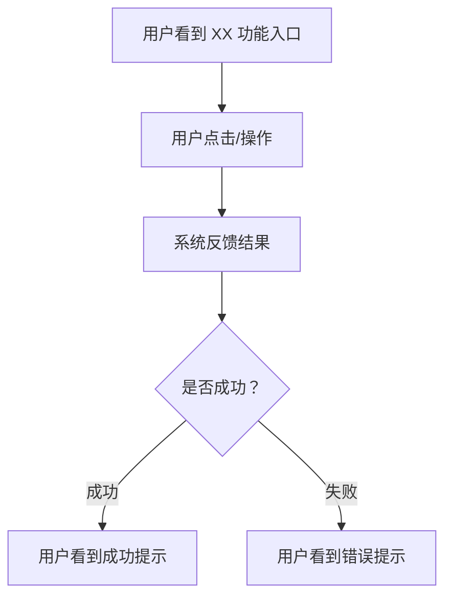
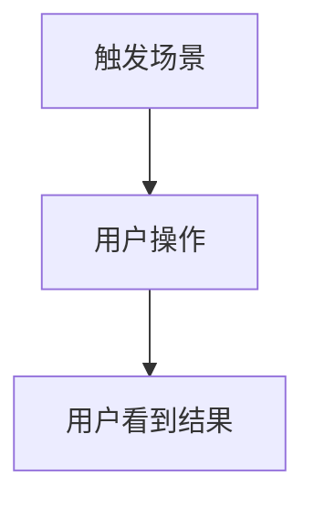

# {Issue ID} - 需求文档

> **状态**: 草稿 / 待确认 / 已确认
> **提出人**: {姓名}
> **日期**: {YYYY-MM-DD}
> **优先级**: P0(紧急) / P1(高) / P2(中) / P3(低)
> **类型**: Feature / Bug / Optimization / Hotfix

---

## 1. 需求描述

{整理后的产品需求内容。图片放入 assets/ 并用相对路径引用。}

{简明扼要地描述需求背景、目标用户、核心诉求。如果是修改现有功能，用一段话说明当前行为和期望变化，不涉及代码。}

---

## 2. 用户故事

{按优先级排列。每个 story 用 Mermaid 流程图描述用户旅程。流程图聚焦产品功能流程：用户看到什么 → 用户做了什么 → 系统给出什么反馈，不涉及内部技术实现细节。}

### US-1: {简要标题} (P1)

{一句话描述这个用户旅程的目标}

### US-2: {简要标题} (P2)

{一句话描述}

---

### 边界场景

| 分类 | 场景 | 处理方式 |
|------|------|---------|
| 输入异常 | {边界条件1} | {处理方式} |
| 重复操作 | {并发/重复操作} | {处理方式} |
| 服务异常 | {外部依赖不可用} | {处理方式} |

---

## 3. 验收标准

{可衡量的、以用户为中心的验收指标。}

| 分类 | # | 验收项 | 衡量标准 |
|------|---|--------|---------|
| 功能正确 | AC-001 | {用户可感知的结果} | {具体数字或明确条件} |
| 功能正确 | AC-002 | {用户可感知的结果} | {具体数字或明确条件} |
| 异常处理 | AC-003 | {用户可感知的结果} | {具体数字或明确条件} |
| 用户体验 | AC-004 | {用户可感知的结果} | {具体数字或明确条件} |

---

## 4. AI 需求评审

{Agent 基于代码分析对需求的综合评审。}

### 评审结论

**完整度**: {高/中/低}
**建议**: {可进入技术方案设计 / 需产品补充以下问题}

### 评审明细

| # | 检查维度 | 状态 | 说明 |
|---|---------|------|------|
| 1 | 正常流程覆盖 | ✅/❌ | {是否覆盖了所有正常路径} |
| 2 | 异常流程覆盖 | ✅/❌ | {是否考虑了错误和异常场景} |
| 3 | 边界条件覆盖 | ✅/❌ | {是否识别了边界情况} |
| 4 | 需求无歧义 | ✅/❌ | {是否存在多种理解方式} |
| 5 | 与现有功能无冲突 | ✅/❌ | {是否与已有业务规则矛盾} |
| 6 | 验收标准可衡量 | ✅/❌ | {是否有明确的验收数字} |
| 7 | 需求范围边界清晰 | ✅/❌ | {做什么、不做什么是否明确} |

---

## 5. 待确认问题

{面向产品经理——聚焦缺失的业务逻辑和规则，不涉及技术实现。}

- **Q1**: {问题}。{一句话说明缺失了什么}
- **Q2**: {问题}。{一句话说明缺失了什么}

---

## 变更记录

| 版本 | 日期 | 变更人 | 变更内容 | 原因 |
|------|------|--------|---------|------|
| v1.0 | {日期} | {姓名} | 初稿 | - |
