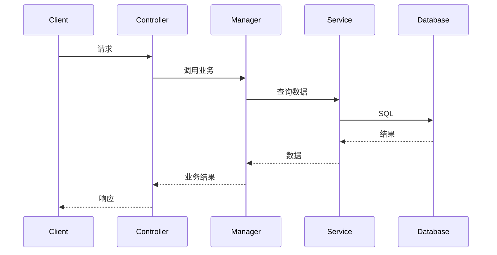
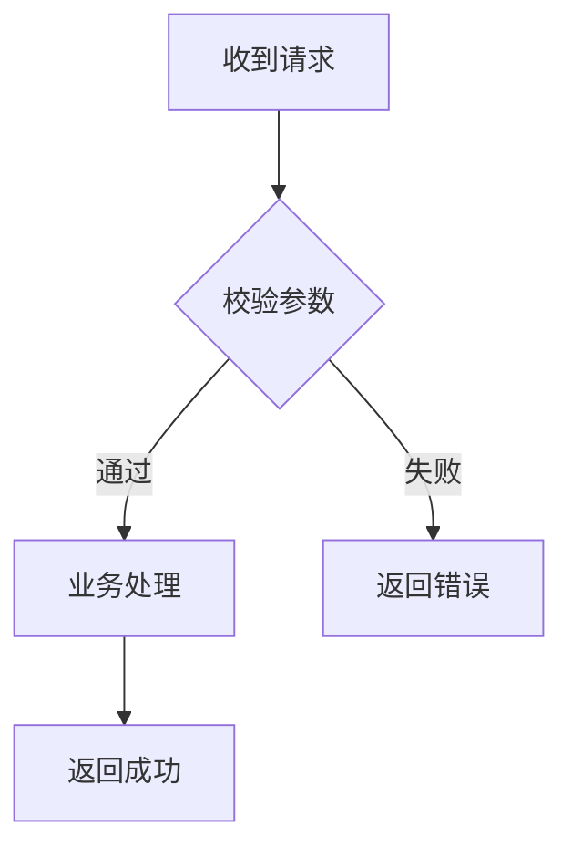

# {Issue ID} - 技术方案

> **状态**: 草稿 / 评审中 / 已确认
> **作者**: {姓名}
> **日期**: {YYYY-MM-DD}
> **关联需求**: [需求文档](./requirement.md)

---

## 1. 概述

{一段话描述技术方案要解决的问题、整体思路和关键技术选型}

---

## 2. 现状分析

### 2.1 现有架构

{描述相关模块的当前实现，配 Mermaid 图}

### 2.2 现有问题

{如果是优化/修复，描述现有问题。纯新功能可写"不适用"。}

---

## 3. 技术调研

{如果方案涉及技术未知项或需要决策的选型，在此记录调研结论。如果方案清晰无未知项，注明"本次方案无技术未知项，跳过调研"。}

### 3.1 {调研主题1}

**背景**: {为什么需要调研}

**结论**: {选择了什么}

**理由**: {为什么选这个}

**替代方案**:

| 方案 | 优点 | 缺点 | 不选择的原因 |
|------|------|------|------------|
| {方案A} | {优点} | {缺点} | {原因} |
| {方案B} | {优点} | {缺点} | {原因} |

### 3.2 {调研主题2}

{同上格式...}

---

## 4. 方案设计

### 4.1 整体架构

{整体技术方案描述，配 Mermaid 架构图}

### 4.2 核心流程

{用 Mermaid sequenceDiagram 展示关键处理路径的完整调用链}



### 4.3 组件设计

#### 4.3.1 {组件名称1}

**职责**: {一句话描述}

**关键逻辑**:
{详细描述处理流程、校验规则、状态变更等核心逻辑}

**注意事项**:
- {特殊点，如安全配置、拦截器排除、线程安全等}

#### 4.3.2 {组件名称2}

{同上格式...}

### 4.4 接口设计

#### `{METHOD} {PATH}` — {接口说明}

**请求**:

| 项目 | 说明 |
|------|------|
| Content-Type | application/json |
| 认证 | 需要 / 不需要 |

**Headers**（如有特殊 Header）:

| Header | 说明 |
|--------|------|
| {header-name} | {说明} |

**请求体**:

```json
{
  "field1": "value1",
  "field2": 123
}
```

**响应**:

```json
{
  "code": 0,
  "msg": "success",
  "data": {
    "field1": "value1"
  }
}
```

**响应参数**:

| 字段   | 类型    | 说明       |
|--------|--------|------------|
| field1 | string | 示例字段（枚举） |

**错误处理**:

| 场景 | 处理方式 | 响应码 | 日志级别 |
|------|---------|--------|---------|
| {场景1} | {处理} | {code} | INFO/WARN/ERROR |
| {场景2} | {处理} | {code} | INFO/WARN/ERROR |

**处理流程**:



#### `{METHOD} {PATH2}` — {接口说明2}

{同上格式...}

### 4.5 数据模型

#### 新增表: {table_name}

| 列名 | 类型 | 可空 | 默认值 | 说明 |
|------|------|------|--------|------|
| id | bigint | NO | auto_increment | 主键 |
| {字段} | {类型} | {YES/NO} | {默认值} | {说明} |

**索引**:

| 索引名 | 列 | 类型 | 说明 |
|--------|-----|------|------|
| {idx_name} | {columns} | UNIQUE/NORMAL | {说明} |

#### 修改表: {table_name}

```sql
ALTER TABLE {table_name} ADD COLUMN {column} {type} {constraints} COMMENT '{说明}';
```

#### 数据初始化

```sql
INSERT INTO {table_name} (...) VALUES (...);
```

### 4.6 配置变更

> 同一功能的相关配置项建议合并为一个 json 字段；不相关的配置，使用不同key；{value}给出具体值。

| 操作   | 配置项           | 值                                      | 说明                  |
|--------|------------------|------------------------------------------|-----------------------|
| 新增   | featureX_config  | {"paramA": "value1", "paramB": "value2"} | 功能 X 的相关配置合并 |
| 修改   | unrelated_key    | true                                    | 其他不相关配置项      |

### 4.7 项目结构

**新增文件**:

| 文件 | 模块 | 说明 |
|------|------|------|
| {文件名.java} | {web/controller} | {说明} |
| {文件名.java} | {biz/manager} | {说明} |

**修改文件**:

| 文件 | 模块 | 变更内容 |
|------|------|---------|
| [文件名](path/File.java) | {模块} | {变更描述} |

---

## 5. 影响分析

### 5.1 功能影响

| 功能/流程 | 影响程度 | 说明 |
|----------|---------|------|
| {功能} | 无影响/需回归/有风险 | {说明} |

### 5.2 性能影响

{QPS 预估、DB 查询复杂度、缓存策略}

### 5.3 兼容性

| 检查项 | 状态 | 说明 |
|--------|------|------|
| API 向后兼容 | 兼容/不兼容/不适用 | {说明} |
| 数据库迁移安全 | 安全/有风险/不适用 | {说明} |
| 客户端版本兼容 | 兼容/不兼容/不适用 | {说明} |

---

## 6. 风险评估

| 风险 | 概率 | 影响 | 应对措施 |
|------|------|------|---------|
| {风险} | 高/中/低 | {影响} | {措施} |

---

## 7. 开发步骤

*按执行顺序排列，可直接作为开发者的实操指南。*

### Step 1: {步骤标题}

{具体操作说明、代码片段等}

### Step 2: {步骤标题}

{具体操作说明}

### Step N: 验证

**本地验证**:
1. {验证步骤1}
2. {验证步骤2}

**集成验证**:
1. {验证步骤1}
2. {验证步骤2}

---

## 变更记录

| 版本 | 日期 | 变更人 | 变更内容 | 原因 |
|------|------|--------|---------|------|
| v1.0 | {日期} | {姓名} | 初稿 | - |
